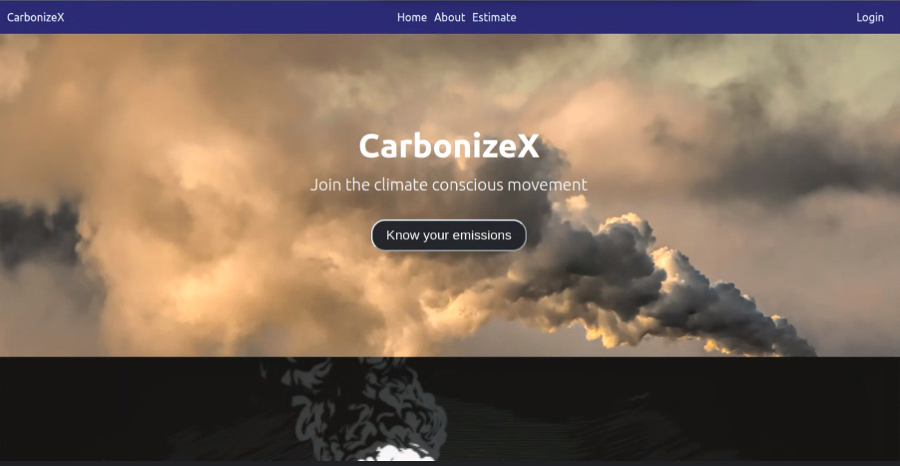
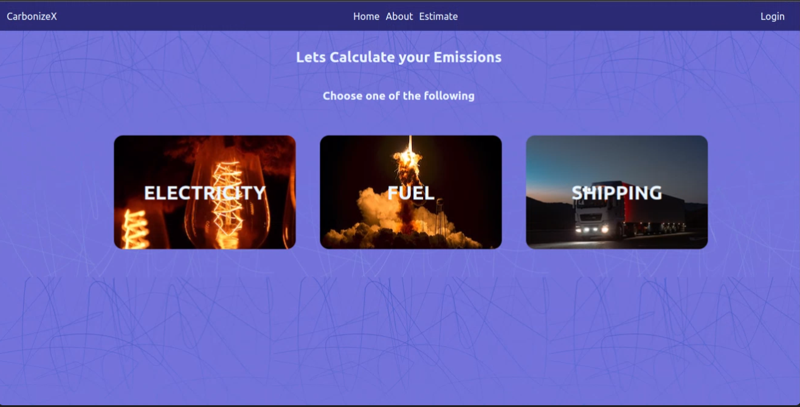

# CarbonizeX App

# Description
CarbonizeX is a web application that aims to help people make more informed decisions about carbon emissions. The app will provide estimates of carbon emissions based on different situations, devices, or machines.

# Background
Climate change is one of the biggest challenges facing our world today. One of the ways we can tackle it is by reducing our carbon emissions. However, it can be difficult to know how much carbon we're emitting and how to reduce it. CarbonizeX will help people know the amount of carbon emissions generated from their activities therefore creating the awareness and enabling actions towards reduction of carbon emissions.

# Using the App
The app is accessible online via this [link](https://radiant-souffle-74def2.netlify.app/). Clicking the 'know your emissions' button or estimates button on the homepage will lead you to the various carbon emissions cartegories page. The categories include Electricity, Fuel & Shipping.

* Electricity 
Enter the consumption in kwh units and click estimate button, the app will then generate the carbon emission in kg.
* Fuel 
Enter the consumption in units and click estimate button, the app will then generate the carbon emission in kg.
* Shipping 
Enter the weight in kg of the cargo and distance covered in km and click estimate button, the app will then generate the carbon emission.

On each category page, there is a link to a tables page where emissions trend are tabulated and visualized using a piechart graph.

# Technologies Used to Develop the App
The app is built using React and uses the Carbon Interface API to retrieve the data for the estimates. 
-node js
-css
-html

# App Screenshots
 
  

# License
MIT License 
Copyright (c) 2023
